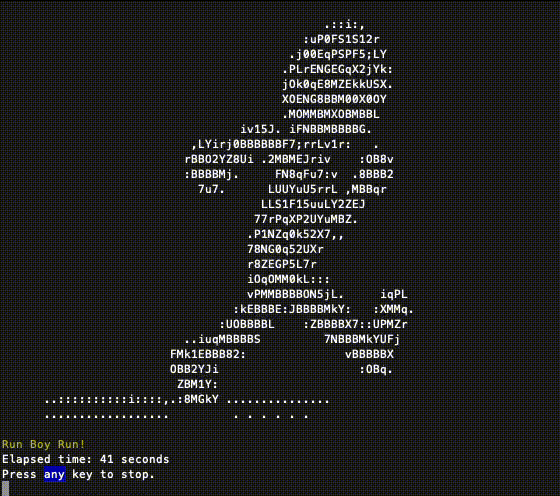

# Run Boy Run


- [Run Boy Run](#run-boy-run)
  - [What is it?](#what-is-it)
  - [Purpose](#purpose)
  - [Prerequisites](#prerequisites)
  - [How to run it](#how-to-run-it)





## What is it?

[caffeinate](https://ss64.com/osx/caffeinate.html) with some bling bling.

## Purpose

Keep your Mac from locking itself & going into standby mode. Especially helpful if company policies wont let you change the timeout settings on your Mac.

## Prerequisites

Have `node` and `npm` installed. If not, run:

```bash
brew install node
```

## How to run it

Simply double-click `run.command`.
